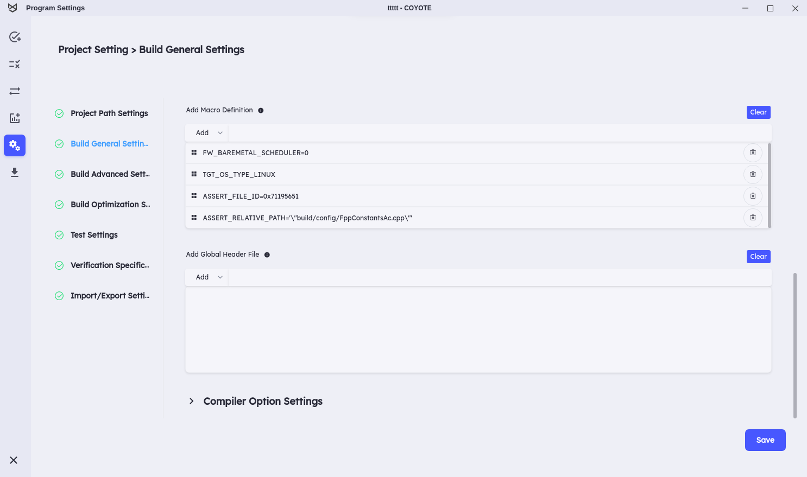

# COYOTE TEST

This repository collects open-source programs. You can run [**Coyote C++**](http://codemind.io) with the following settings.

## Test Results

You can view the results of the tests conducted with Coyote C++ at the following link. [[Link]](result/html_report.md)

# How to get and use these projects

## System Requirements

Make sure your system meets the following prerequisites:

- Linux operating system
- git
- Make
- Boost 1.71+
- CMake 3.16+
- CLang or GNU C and C++ compilers (e.g. gcc and g++)
- Python 3.8+, virtual environments, and PIP

## From sources

To use these projects, it is necessary to install the basic programs as follows:

- Git (any recent version will do).

Then clone this repository and run the following commands.

```
git clone https://github.com/codemind-research/coyote-test.git

# If you intend to run tests, you have to clone the submodules too.

cd coyote-test

git submodule update --init --recursive

```

### Building the Project

Please navigate to the TestProjects directory and execute the `./build.sh` script. This script automatically builds the submodules located in the TestProjects directory.

> [!WARNING]
> Coyote C++ needs to build the target project before it can start the testing process. Thus, if the build process fails due to e.g. missing dependencies (libraries), the source files dynamically created in the build process may cause problems during testing. In this case, please check your projects dependencies and install any missing libraries. After that, build the project again.

## **Coyote C++ Settings**

It is essential to configure the following settings when using this tool for testing. To configure your project, please navigate to **Project Settings** and apply the settings described below.
<br>
`This option should be applied uniformly to all test projects.`

> [!WARNING]
> Follow the steps below to configure the project:
> <br> &nbsp; &nbsp; 1.**Git Commands**: [Clone the project and update submodules.](#from-sources) <br> &nbsp; &nbsp; 2.**Run the Build Script**: [Build the project.](#building-the-project)
>
> Failure to execute the commands at the top may prevent Coyote C++ from initiating tests, causing potential issues during testing. Additionally, modifying settings other than those explained in the bottom section of the Project Settings page might lead to problems during test runs. Therefore, proceed with caution and strictly adhere to the provided instructions.

<br>

> **Add Header File Directory**

- Go to **Project Setting > Build General Settings > Add Header File Directory**.
- In the **Add Header File Directory** option, select **All source code paths**.

  

> **Add Macro Definition**

- Go to **Project Setting > Build General Settings > Add Macro Definition**.
- Apply these options only to the fprime project.
- Then, add the following options:

  - `FW_BAREMETAL_SCHEDULER=0`
  - `TGT_OS_TYPE_LINUX`
  - `ASSERT_FILE_ID=0x71195651`
  - `ASSERT_RELATIVE_PATH='\"build/config/FppConstantsAc.cpp\"'`

  

> **Test Settings**

- Go to **Project Setting > Test Settings**.
  <br>
  Performance Criteria : Balanced
  <br>
  

### **Select list**

**Coyote C++** can currently calculate accurate coverage only for buildable files. Below is a list of files to build in each project. Please apply this list to the **SELECT** dialog.


### JsonBox

<details>
<summary>select.list</summary>

```
src/src/JsonWritingError.cpp
src/src/Value.cpp
src/src/SolidusEscaper.cpp
src/src/Escaper.cpp
src/src/Indenter.cpp
src/src/IndentCanceller.cpp
src/src/JsonParsingError.cpp
src/src/Convert.cpp
```

</details>

### hjson-cpp

<details>
<summary>select.list</summary>

```
src/src/hjson_decode.cpp
src/src/hjson_encode.cpp
src/src/hjson_parsenumber.cpp
src/src/hjson_value.cpp
```

</details>

### json-voorhees

<details>
<summary>select.list</summary>

```
src/src/jsonv/algorithm_compare.cpp
src/src/jsonv/algorithm_diff.cpp
src/src/jsonv/algorithm_map.cpp
src/src/jsonv/algorithm_merge.cpp
src/src/jsonv/algorithm_traverse.cpp
src/src/jsonv/algorithm_validate.cpp
src/src/jsonv/array.cpp
src/src/jsonv/char_convert.cpp
src/src/jsonv/coerce.cpp
src/src/jsonv/demangle.cpp
src/src/jsonv/detail.cpp
src/src/jsonv/detail/token_patterns.cpp
src/src/jsonv/encode.cpp
src/src/jsonv/functional.cpp
src/src/jsonv/object.cpp
src/src/jsonv/parse.cpp
src/src/jsonv/path.cpp
src/src/jsonv/serialization.cpp
src/src/jsonv/serialization_builder.cpp
src/src/jsonv/tokenizer.cpp
src/src/jsonv/value.cpp
```

</details>

### jsoncpp

<details>
<summary>select.list</summary>

```
src/src/lib_json/json_value.cpp
src/src/lib_json/json_reader.cpp
src/src/lib_json/json_writer.cpp
```

</details>

### jvar

<details>
<summary>select.list</summary>

```
src/src/str.cpp
src/src/util.cpp
src/src/arr.cpp
src/src/var.cpp
src/src/json.cpp
```

</details>

### re2

<details>
<summary>select.list</summary>

```
src/re2/nfa.cc
src/re2/onepass.cc
src/re2/parse.cc
src/re2/bitstate.cc
src/re2/compile.cc
src/re2/dfa.cc
src/re2/filtered_re2.cc
src/re2/mimics_pcre.cc
src/re2/perl_groups.cc
src/re2/prefilter.cc
src/re2/prefilter_tree.cc
src/re2/prog.cc
src/re2/re2.cc
src/re2/regexp.cc
src/re2/set.cc
src/re2/simplify.cc
src/re2/stringpiece.cc
src/re2/tostring.cc
src/re2/unicode_casefold.cc
src/re2/unicode_groups.cc
src/util/rune.cc
src/util/strutil.cc
src/util/pcre.cc
```

</details>

### tinyxml2

<details>
<summary>select.list</summary>

```
src/tinyxml2.cpp
```

</details>

### yaml-cpp

<details>
<summary>select.list</summary>

```
src/src/contrib/graphbuilderadapter.cpp
src/src/binary.cpp
src/src/convert.cpp
src/src/depthguard.cpp
src/src/directives.cpp
src/src/emit.cpp
src/src/emitfromevents.cpp
src/src/emitter.cpp
src/src/emitterstate.cpp
src/src/emitterutils.cpp
src/src/exceptions.cpp
src/src/exp.cpp
src/src/memory.cpp
src/src/node.cpp
src/src/node_data.cpp
src/src/nodebuilder.cpp
src/src/nodeevents.cpp
src/src/null.cpp
src/src/ostream_wrapper.cpp
src/src/parse.cpp
src/src/parser.cpp
src/src/regex_yaml.cpp
src/src/scanner.cpp
src/src/scanscalar.cpp
src/src/scantag.cpp
src/src/scantoken.cpp
src/src/simplekey.cpp
src/src/singledocparser.cpp
src/src/stream.cpp
src/src/tag.cpp
src/util/read.cpp
src/util/parse.cpp
src/util/sandbox.cpp
```

</details>

### fprime

<details>
<summary>select.list</summary>

```
src/Utils/Hash/HashCommon.cpp
src/Utils/Hash/HashBufferCommon.cpp
src/Utils/Hash/libcrc/CRC32.cpp
src/Utils/Hash/libcrc/lib_crc.c
src/Utils/LockGuard.cpp
src/Utils/RateLimiter.cpp
src/Utils/TokenBucket.cpp
src/Utils/Types/CircularBuffer.cpp
src/Utils/Types/Queue.cpp
src/Utils/CRCChecker.cpp
src/build/config/FppConstantsAc.cpp
src/build/F-Prime/Fw/Cmd/CmdResponseEnumAc.cpp
src/build/F-Prime/Fw/Cmd/CmdResponsePortAc.cpp
src/build/F-Prime/Fw/Cmd/CmdPortAc.cpp
src/build/F-Prime/Fw/Cmd/CmdRegPortAc.cpp
src/build/F-Prime/Fw/Time/TimePortAc.cpp
src/build/F-Prime/Fw/Ports/SuccessCondition/SuccessConditionPortAc.cpp
src/build/F-Prime/Fw/Com/ComPortAc.cpp
src/build/F-Prime/Fw/Tlm/TlmGetPortAc.cpp
src/build/F-Prime/Fw/Tlm/TlmPortAc.cpp
src/build/F-Prime/Fw/Buffer/BufferSendPortAc.cpp
src/build/F-Prime/Fw/Buffer/BufferGetPortAc.cpp
src/build/F-Prime/Fw/Prm/PrmGetPortAc.cpp
src/build/F-Prime/Fw/Prm/PrmSetPortAc.cpp
src/build/F-Prime/Fw/Prm/ParamValidEnumAc.cpp
src/build/F-Prime/Fw/Types/LogicEnumAc.cpp
src/build/F-Prime/Fw/Types/HealthEnumAc.cpp
src/build/F-Prime/Fw/Types/DirectionEnumAc.cpp
src/build/F-Prime/Fw/Types/EnabledEnumAc.cpp
src/build/F-Prime/Fw/Types/SerialStatusEnumAc.cpp
src/build/F-Prime/Fw/Types/ActiveEnumAc.cpp
src/build/F-Prime/Fw/Types/OpenEnumAc.cpp
src/build/F-Prime/Fw/Types/DeserialStatusEnumAc.cpp
src/build/F-Prime/Fw/Types/OnEnumAc.cpp
src/build/F-Prime/Fw/Types/SuccessEnumAc.cpp
src/build/F-Prime/Fw/Log/LogSeverityEnumAc.cpp
src/build/F-Prime/Fw/Log/LogTextPortAc.cpp
src/build/F-Prime/Fw/Log/LogPortAc.cpp
src/build/F-Prime/Drv/SpiDriverPorts/SpiReadWritePortAc.cpp
src/build/F-Prime/Drv/TcpClient/TcpClientComponentAc.cpp
src/build/F-Prime/Drv/DataTypes/DataBufferPortAc.cpp
src/build/F-Prime/Drv/StreamCrossover/StreamCrossoverComponentAc.cpp
src/build/F-Prime/Drv/GpioDriverPorts/GpioReadPortAc.cpp
src/build/F-Prime/Drv/GpioDriverPorts/GpioWritePortAc.cpp
src/build/F-Prime/Drv/ByteStreamDriverModel/PollStatusEnumAc.cpp
src/build/F-Prime/Drv/ByteStreamDriverModel/RecvStatusEnumAc.cpp
src/build/F-Prime/Drv/ByteStreamDriverModel/ByteStreamReadyPortAc.cpp
src/build/F-Prime/Drv/ByteStreamDriverModel/SendStatusEnumAc.cpp
src/build/F-Prime/Drv/ByteStreamDriverModel/ByteStreamSendPortAc.cpp
src/build/F-Prime/Drv/ByteStreamDriverModel/ByteStreamRecvPortAc.cpp
src/build/F-Prime/Drv/ByteStreamDriverModel/ByteStreamPollPortAc.cpp
src/build/F-Prime/Drv/LinuxUartDriver/LinuxUartDriverComponentAc.cpp
src/build/F-Prime/Drv/LinuxI2cDriver/LinuxI2cDriverComponentAc.cpp
src/build/F-Prime/Drv/LinuxSpiDriver/LinuxSpiDriverComponentAc.cpp
src/build/F-Prime/Drv/BlockDriver/BlockDriverComponentAc.cpp
src/build/F-Prime/Drv/I2cDriverPorts/I2cWriteReadPortAc.cpp
src/build/F-Prime/Drv/I2cDriverPorts/I2cPortAc.cpp
src/build/F-Prime/Drv/I2cDriverPorts/I2cStatusEnumAc.cpp
src/build/F-Prime/Drv/TcpServer/TcpServerComponentAc.cpp
src/build/F-Prime/Drv/LinuxGpioDriver/LinuxGpioDriverComponentAc.cpp
src/build/F-Prime/Drv/Udp/UdpComponentAc.cpp
src/build/F-Prime/Svc/Sched/SchedPortAc.cpp
src/build/F-Prime/Svc/BufferManager/BufferManagerComponentAc.cpp
src/build/F-Prime/Svc/BufferAccumulator/BufferAccumulatorComponentAc.cpp
src/build/F-Prime/Svc/BufferAccumulator/BufferAccumulator_OpStateEnumAc.cpp
src/build/F-Prime/Svc/BufferAccumulator/BufferAccumulator_BlockModeEnumAc.cpp
src/build/F-Prime/Svc/PolyDb/PolyDbComponentAc.cpp
src/build/F-Prime/Svc/StaticMemory/StaticMemoryComponentAc.cpp
src/build/F-Prime/Svc/LinuxTimer/LinuxTimerComponentAc.cpp
src/build/F-Prime/Svc/FileDownlink/FileDownlinkComponentAc.cpp
src/build/F-Prime/Svc/Health/HealthComponentAc.cpp
src/build/F-Prime/Svc/AssertFatalAdapter/AssertFatalAdapterComponentAc.cpp
src/build/F-Prime/Svc/SystemResources/SystemResourcesComponentAc.cpp
src/build/F-Prime/Svc/SystemResources/SystemResourceEnabledEnumAc.cpp
src/build/F-Prime/Svc/ComLogger/ComLoggerComponentAc.cpp
src/build/F-Prime/Svc/ComQueue/BuffQueueDepthArrayAc.cpp
src/build/F-Prime/Svc/ComQueue/ComQueueComponentAc.cpp
src/build/F-Prime/Svc/ComQueue/QueueTypeEnumAc.cpp
src/build/F-Prime/Svc/ComQueue/ComQueueDepthArrayAc.cpp
src/build/F-Prime/Svc/Deframer/DeframerComponentAc.cpp
src/build/F-Prime/Svc/ActiveTextLogger/ActiveTextLoggerComponentAc.cpp
src/build/F-Prime/Svc/RateGroupDriver/RateGroupDriverComponentAc.cpp
src/build/F-Prime/Svc/Cycle/CyclePortAc.cpp
src/build/F-Prime/Svc/PolyIf/PolyPortAc.cpp
src/build/F-Prime/Svc/PolyIf/MeasurementStatusEnumAc.cpp
src/build/F-Prime/Svc/BufferLogger/BufferLogger_LogStateEnumAc.cpp
src/build/F-Prime/Svc/BufferLogger/BufferLoggerComponentAc.cpp
src/build/F-Prime/Svc/PassiveConsoleTextLogger/PassiveTextLoggerComponentAc.cpp
src/build/F-Prime/Svc/Seq/CmdSeqInPortAc.cpp
src/build/F-Prime/Svc/Seq/CmdSeqCancelPortAc.cpp
src/build/F-Prime/Svc/FatalHandler/FatalHandlerComponentAc.cpp
src/build/F-Prime/Svc/PassiveRateGroup/PassiveRateGroupComponentAc.cpp
src/build/F-Prime/Svc/CmdDispatcher/CommandDispatcherComponentAc.cpp
src/build/F-Prime/Svc/BufferRepeater/BufferRepeaterComponentAc.cpp
src/build/F-Prime/Svc/FileUplink/FileUplinkComponentAc.cpp
src/build/F-Prime/Svc/Fatal/FatalEventPortAc.cpp
src/build/F-Prime/Svc/GenericHub/GenericHubComponentAc.cpp
src/build/F-Prime/Svc/CmdSequencer/CmdSequencer_FileReadStageEnumAc.cpp
src/build/F-Prime/Svc/CmdSequencer/CmdSequencer_BlockStateEnumAc.cpp
src/build/F-Prime/Svc/CmdSequencer/CmdSequencerComponentAc.cpp
src/build/F-Prime/Svc/CmdSequencer/CmdSequencer_SeqModeEnumAc.cpp
src/build/F-Prime/Svc/ActiveLogger/ActiveLogger_EnabledEnumAc.cpp
src/build/F-Prime/Svc/ActiveLogger/ActiveLoggerComponentAc.cpp
src/build/F-Prime/Svc/ActiveLogger/ActiveLogger_FilterSeverityEnumAc.cpp
src/build/F-Prime/Svc/Framer/FramerComponentAc.cpp
src/build/F-Prime/Svc/ComSplitter/ComSplitterComponentAc.cpp
src/build/F-Prime/Svc/Ping/PingPortAc.cpp
src/build/F-Prime/Svc/PosixTime/PosixTimeComponentAc.cpp
src/build/F-Prime/Svc/ActiveRateGroup/ActiveRateGroupComponentAc.cpp
src/build/F-Prime/Svc/ComStub/ComStubComponentAc.cpp
src/build/F-Prime/Svc/TlmPacketizer/TlmPacketizerComponentAc.cpp
src/build/F-Prime/Svc/FileDownlinkPorts/SendFileRequestPortAc.cpp
src/build/F-Prime/Svc/FileDownlinkPorts/SendFileCompletePortAc.cpp
src/build/F-Prime/Svc/FileDownlinkPorts/SendFileStatusEnumAc.cpp
src/build/F-Prime/Svc/FileDownlinkPorts/SendFileResponseSerializableAc.cpp
src/build/F-Prime/Svc/TlmChan/TlmChanComponentAc.cpp
src/build/F-Prime/Svc/FileManager/FileManagerComponentAc.cpp
src/build/F-Prime/Svc/CmdSplitter/CmdSplitterComponentAc.cpp
src/build/F-Prime/Svc/WatchDog/WatchDogPortAc.cpp
src/build/F-Prime/Svc/GroundInterface/GroundInterfaceComponentAc.cpp
src/build/F-Prime/Svc/PrmDb/PrmDbComponentAc.cpp
src/build/F-Prime/Svc/PrmDb/PrmDb_PrmReadErrorEnumAc.cpp
src/build/F-Prime/Svc/PrmDb/PrmDb_PrmWriteErrorEnumAc.cpp
src/Fw/Cmd/CmdPacket.cpp
src/Fw/Cmd/CmdString.cpp
src/Fw/Cmd/CmdArgBuffer.cpp
src/Fw/SerializableFile/SerializableFile.cpp
src/Fw/Time/Time.cpp
src/Fw/Com/ComPacket.cpp
src/Fw/Com/ComBuffer.cpp
src/Fw/Tlm/TlmBuffer.cpp
src/Fw/Tlm/TlmPacket.cpp
src/Fw/Tlm/TlmString.cpp
src/Fw/Obj/ObjBase.cpp
src/Fw/Obj/SimpleObjRegistry.cpp
src/Fw/Buffer/Buffer.cpp
src/Fw/Prm/PrmString.cpp
src/Fw/Prm/PrmBuffer.cpp
src/Fw/Logger/Logger.cpp
src/Fw/Logger/LogAssert.cpp
src/Fw/Comp/ActiveComponentBase.cpp
src/Fw/Comp/QueuedComponentBase.cpp
src/Fw/Comp/PassiveComponentBase.cpp
src/Fw/Types/SerialBuffer.cpp
src/Fw/Types/String.cpp
src/Fw/Types/StringUtils.cpp
src/Fw/Types/MemAllocator.cpp
src/Fw/Types/Assert.cpp
src/Fw/Types/PolyType.cpp
src/Fw/Types/Serializable.cpp
src/Fw/Types/MallocAllocator.cpp
src/Fw/Types/InternalInterfaceString.cpp
src/Fw/Types/StringType.cpp
src/Fw/Log/LogString.cpp
src/Fw/Log/TextLogString.cpp
src/Fw/Log/LogPacket.cpp
src/Fw/Log/LogBuffer.cpp
src/Fw/Port/InputPortBase.cpp
src/Fw/Port/OutputPortBase.cpp
src/Fw/Port/PortBase.cpp
src/Fw/Port/OutputSerializePort.cpp
src/Fw/Port/InputSerializePort.cpp
src/Fw/FilePacket/FilePacket.cpp
src/Fw/FilePacket/PathName.cpp
src/Fw/FilePacket/DataPacket.cpp
src/Fw/FilePacket/CancelPacket.cpp
src/Fw/FilePacket/StartPacket.cpp
src/Fw/FilePacket/Header.cpp
src/Fw/FilePacket/EndPacket.cpp
src/Fw/Cfg/ConfigCheck.cpp
src/Drv/Ip/TcpServerSocket.cpp
src/Drv/Ip/IpSocket.cpp
src/Drv/Ip/TcpClientSocket.cpp
src/Drv/Ip/SocketReadTask.cpp
src/Drv/Ip/UdpSocket.cpp
src/Drv/TcpClient/TcpClientComponentImpl.cpp
src/Drv/DataTypes/DataBuffer.cpp
src/Drv/StreamCrossover/StreamCrossover.cpp
src/Drv/LinuxUartDriver/LinuxUartDriver.cpp
src/Drv/LinuxI2cDriver/LinuxI2cDriver.cpp
src/Drv/LinuxSpiDriver/LinuxSpiDriverComponentImpl.cpp
src/Drv/LinuxSpiDriver/LinuxSpiDriverComponentImplCommon.cpp
src/Drv/BlockDriver/BlockDriverImpl.cpp
src/Drv/TcpServer/TcpServerComponentImpl.cpp
src/Drv/LinuxGpioDriver/LinuxGpioDriverComponentImplCommon.cpp
src/Drv/LinuxGpioDriver/LinuxGpioDriverComponentImpl.cpp
src/Drv/Udp/UdpComponentImpl.cpp
src/CFDP/Checksum/Checksum.cpp
src/Svc/BufferManager/BufferManagerComponentImpl.cpp
src/Svc/BufferAccumulator/BufferAccumulator.cpp
src/Svc/BufferAccumulator/ArrayFIFOBuffer.cpp
src/Svc/PolyDb/PolyDbImpl.cpp
src/Svc/StaticMemory/StaticMemoryComponentImpl.cpp
src/Svc/LinuxTimer/LinuxTimerComponentImplCommon.cpp
src/Svc/LinuxTimer/LinuxTimerComponentImplTimerFd.cpp
src/Svc/FileDownlink/FileDownlink.cpp
src/Svc/FileDownlink/Warnings.cpp
src/Svc/FileDownlink/File.cpp
src/Svc/Health/Stub/HealthComponentStubChecks.cpp
src/Svc/Health/HealthComponentImpl.cpp
src/Svc/AssertFatalAdapter/AssertFatalAdapterComponentImpl.cpp
src/Svc/SystemResources/SystemResources.cpp
src/Svc/ComLogger/ComLogger.cpp
src/Svc/ComQueue/ComQueue.cpp
src/Svc/Deframer/Deframer.cpp
src/Svc/ActiveTextLogger/LogFile.cpp
src/Svc/ActiveTextLogger/ActiveTextLoggerImpl.cpp
src/Svc/RateGroupDriver/RateGroupDriver.cpp
src/Svc/Cycle/TimerVal.cpp
src/Svc/BufferLogger/BufferLoggerFile.cpp
src/Svc/BufferLogger/BufferLogger.cpp
src/Svc/PassiveConsoleTextLogger/ConsoleTextLoggerImplCommon.cpp
src/Svc/FatalHandler/FatalHandlerComponentLinuxImpl.cpp
src/Svc/FatalHandler/FatalHandlerComponentCommonImpl.cpp
src/Svc/PassiveRateGroup/PassiveRateGroup.cpp
src/Svc/CmdDispatcher/CommandDispatcherImpl.cpp
src/Svc/BufferRepeater/BufferRepeater.cpp
src/Svc/FileUplink/Warnings.cpp
src/Svc/FileUplink/FileUplink.cpp
src/Svc/FileUplink/File.cpp
src/Svc/GenericHub/GenericHubComponentImpl.cpp
src/Svc/CmdSequencer/Events.cpp
src/Svc/CmdSequencer/CmdSequencerImpl.cpp
src/Svc/CmdSequencer/FPrimeSequence.cpp
src/Svc/CmdSequencer/Sequence.cpp
src/Svc/CmdSequencer/formats/AMPCSSequence.cpp
src/Svc/ActiveLogger/ActiveLoggerImpl.cpp
src/Svc/Framer/Framer.cpp
src/Svc/ComSplitter/ComSplitter.cpp
src/Svc/PosixTime/PosixTime.cpp
src/Svc/ActiveRateGroup/ActiveRateGroup.cpp
src/Svc/ComStub/ComStub.cpp
src/Svc/TlmPacketizer/TlmPacketizer.cpp
src/Svc/FramingProtocol/FprimeProtocol.cpp
src/Svc/FramingProtocol/FramingProtocol.cpp
src/Svc/FramingProtocol/DeframingProtocol.cpp
src/Svc/TlmChan/TlmChan.cpp
src/Svc/FileManager/FileManager.cpp
src/Svc/CmdSplitter/CmdSplitter.cpp
src/Svc/GroundInterface/GroundInterface.cpp
src/Svc/PrmDb/PrmDbImpl.cpp
src/Os/ValidatedFile.cpp
src/Os/QueueString.cpp
src/Os/TaskString.cpp
src/Os/QueueCommon.cpp
src/Os/IPCQueueCommon.cpp
src/Os/SimpleQueueRegistry.cpp
src/Os/LogPrintf.cpp
src/Os/FileCommon.cpp
src/Os/Pthreads/PriorityBufferQueue.cpp
src/Os/Pthreads/Queue.cpp
src/Os/Pthreads/BufferQueueCommon.cpp
src/Os/Pthreads/MaxHeap/MaxHeap.cpp
src/Os/Posix/LocklessQueue.cpp
src/Os/Posix/TaskId.cpp
src/Os/Posix/IPCQueue.cpp
src/Os/Posix/Task.cpp
src/Os/Posix/IntervalTimer.cpp
src/Os/Posix/Mutex.cpp
src/Os/Linux/FileSystem.cpp
src/Os/Linux/InterruptLock.cpp
src/Os/Linux/Directory.cpp
src/Os/Linux/SystemResources.cpp
src/Os/Linux/File.cpp
src/Os/Linux/WatchdogTimer.cpp
src/Os/TaskCommon.cpp
src/Os/MemCommon.cpp
src/Os/ValidateFileCommon.cpp
src/Os/LogDefault.cpp
src/Os/IntervalTimerCommon.cpp
```

</details>
