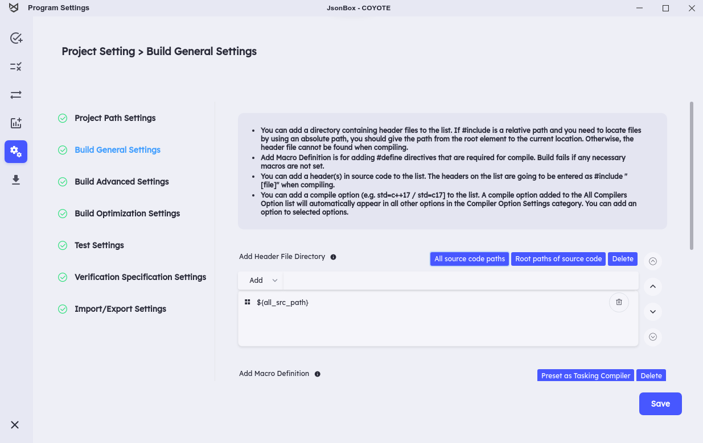
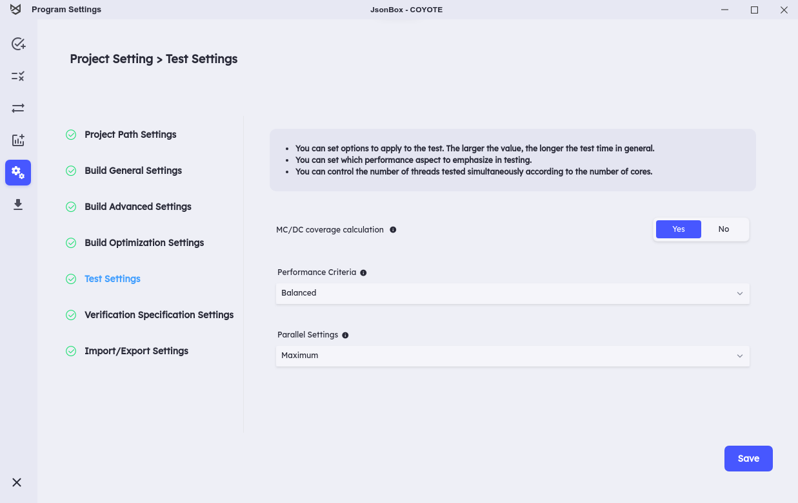
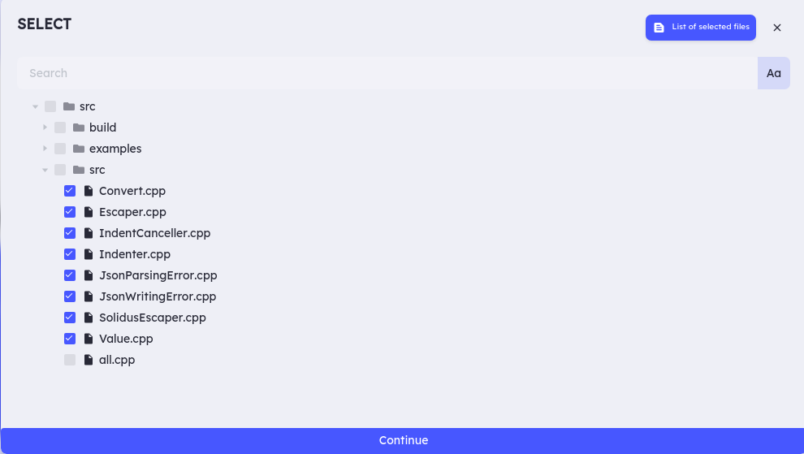

# COYOTE TEST

This repository collects open-source programs. you can run [**Coyote C++**](https://github.com/codemind-research/CoyoteCPP) with the following settings.

## Test Results

You can view the results of the tests conducted with Coyote C++ at the following link. [[Link]](result/html_report.md)

## How to get and use these projects

### From sources

To use these projects, it is necessary to install the basic programs as follows:

- Git (any recent version will do).

Then clone this repository and run the following commands.

```
git clone https://github.com/codemind-research/TestProjects.git

# If you intend to run tests, you have to clone the submodules too.

cd TestProjects

git submodule update --init --recursive

./build.sh
```

### Build

Install the following basic prerequisites:

- CMake
- Make
- Boost (Version 1.71)

Please navigate to the TestProjects directory and execute the `./build.sh` script. This script automatically builds the submodules located in the TestProjects directory.

> [!WARNING]
> Coyote C++ needs to build the target project before it can start the testing process. Thus, if the build process fails due to e.g. missing dependencies (libraries), the source files dynamically created in the build process may cause problems during testing. In this case, please check your projects dependencies and install any missing libraries. After that, build the project again.

## **Coyote C++ Settings**

It is essential to configure the following settings when using this tool for testing. To configure your project, please navigate to **Project Settings** and apply the settings described below.
<br>
`This option should be applied uniformly to all test projects.`

> [!WARNING]
> If you do not execute the command at the top, issues may arise during testing. Please be sure to run the preceding command first.
> If you modify any settings other than those explained in the bottom section on the Project Settings page, it may cause issues during test runs. Therefore, please follow the instructions below for the configuration excluding the ones described.

<br>

> **Add Header File Directory**

- Go to **Project Setting > Build General Settings > Add Header File Directory**.
- In the **Add Header File Directory** option, select **All source code paths**.

  

> **Test Settings**

- Go to **Project Setting > Test Settings**.
  <br>
  Performance Criteria : Balanced
  <br>
  Parallel Settings : Maximum
  

## **Select list**

**Coyote C++** can currently calculate accurate coverage only for the build files. Below is a list of files to build in each project. Please apply this list to the **SELECT** dialog.


### JsonBox

```
src/src/JsonWritingError.cpp
src/src/Value.cpp
src/src/SolidusEscaper.cpp
src/src/Escaper.cpp
src/src/Indenter.cpp
src/src/IndentCanceller.cpp
src/src/JsonParsingError.cpp
src/src/Convert.cpp
```

### hjson-cpp

```
src/src/hjson_decode.cpp
src/src/hjson_encode.cpp
src/src/hjson_parsenumber.cpp
src/src/hjson_value.cpp
```

### json-voorhees

```
src/src/jsonv/algorithm_compare.cpp
src/src/jsonv/algorithm_diff.cpp
src/src/jsonv/algorithm_map.cpp
src/src/jsonv/algorithm_merge.cpp
src/src/jsonv/algorithm_traverse.cpp
src/src/jsonv/algorithm_validate.cpp
src/src/jsonv/array.cpp
src/src/jsonv/char_convert.cpp
src/src/jsonv/coerce.cpp
src/src/jsonv/demangle.cpp
src/src/jsonv/detail.cpp
src/src/jsonv/detail/token_patterns.cpp
src/src/jsonv/encode.cpp
src/src/jsonv/functional.cpp
src/src/jsonv/object.cpp
src/src/jsonv/parse.cpp
src/src/jsonv/path.cpp
src/src/jsonv/serialization.cpp
src/src/jsonv/serialization_builder.cpp
src/src/jsonv/tokenizer.cpp
src/src/jsonv/value.cpp
```

### jsoncpp

```
src/src/lib_json/json_value.cpp
src/src/lib_json/json_reader.cpp
src/src/lib_json/json_writer.cpp
```

### jvar

```
src/src/str.cpp
src/src/util.cpp
src/src/arr.cpp
src/src/var.cpp
src/src/json.cpp
```

### re2

```
src/re2/nfa.cc
src/re2/onepass.cc
src/re2/parse.cc
src/re2/bitstate.cc
src/re2/compile.cc
src/re2/dfa.cc
src/re2/filtered_re2.cc
src/re2/mimics_pcre.cc
src/re2/perl_groups.cc
src/re2/prefilter.cc
src/re2/prefilter_tree.cc
src/re2/prog.cc
src/re2/re2.cc
src/re2/regexp.cc
src/re2/set.cc
src/re2/simplify.cc
src/re2/stringpiece.cc
src/re2/tostring.cc
src/re2/unicode_casefold.cc
src/re2/unicode_groups.cc
src/util/rune.cc
src/util/strutil.cc
src/util/pcre.cc
```

### tinyxml2

```
src/tinyxml2.cpp
```

### yaml-cpp

```
src/src/contrib/graphbuilderadapter.cpp
src/src/binary.cpp
src/src/convert.cpp
src/src/depthguard.cpp
src/src/directives.cpp
src/src/emit.cpp
src/src/emitfromevents.cpp
src/src/emitter.cpp
src/src/emitterstate.cpp
src/src/emitterutils.cpp
src/src/exceptions.cpp
src/src/exp.cpp
src/src/memory.cpp
src/src/node.cpp
src/src/node_data.cpp
src/src/nodebuilder.cpp
src/src/nodeevents.cpp
src/src/null.cpp
src/src/ostream_wrapper.cpp
src/src/parse.cpp
src/src/parser.cpp
src/src/regex_yaml.cpp
src/src/scanner.cpp
src/src/scanscalar.cpp
src/src/scantag.cpp
src/src/scantoken.cpp
src/src/simplekey.cpp
src/src/singledocparser.cpp
src/src/stream.cpp
src/src/tag.cpp
src/util/read.cpp
src/util/parse.cpp
src/util/sandbox.cpp
```
